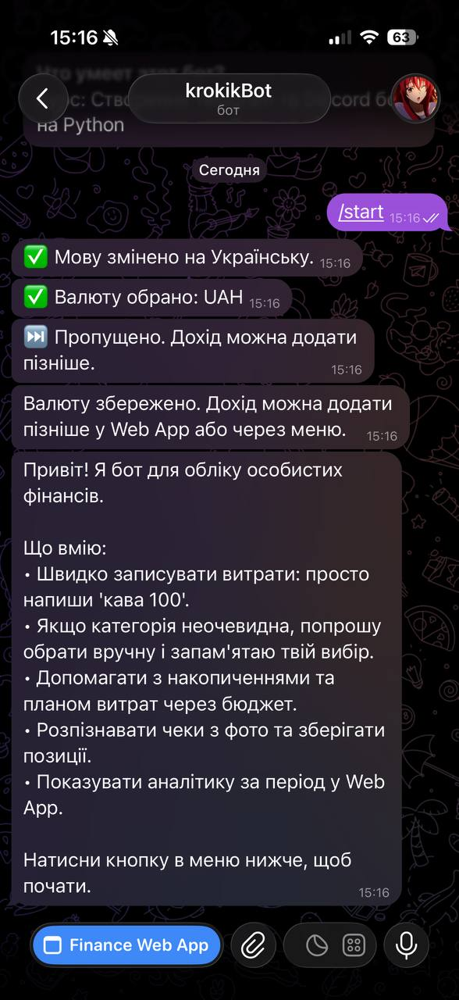
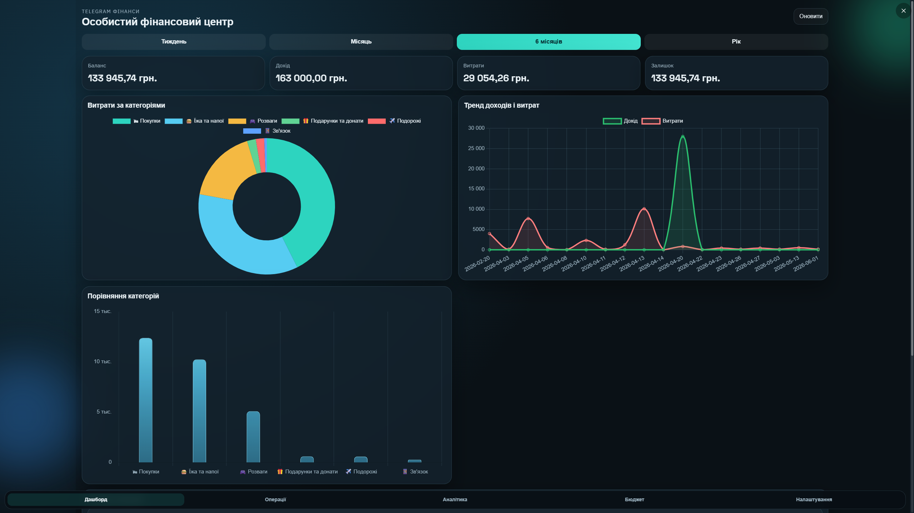
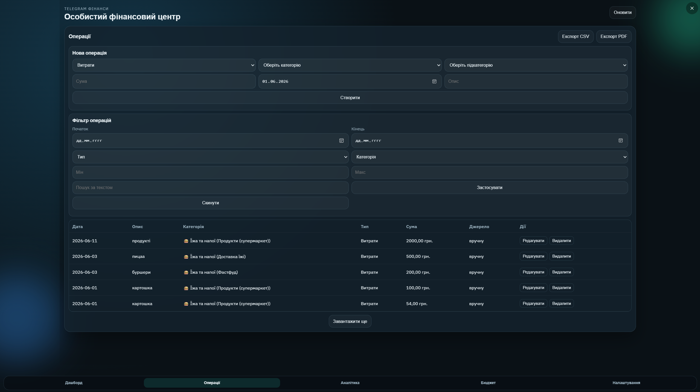
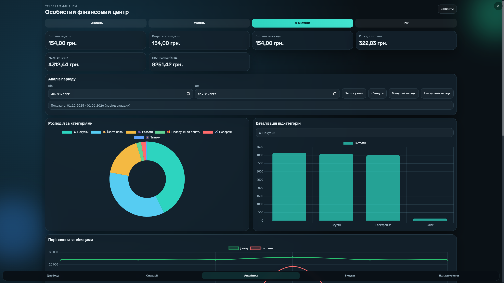
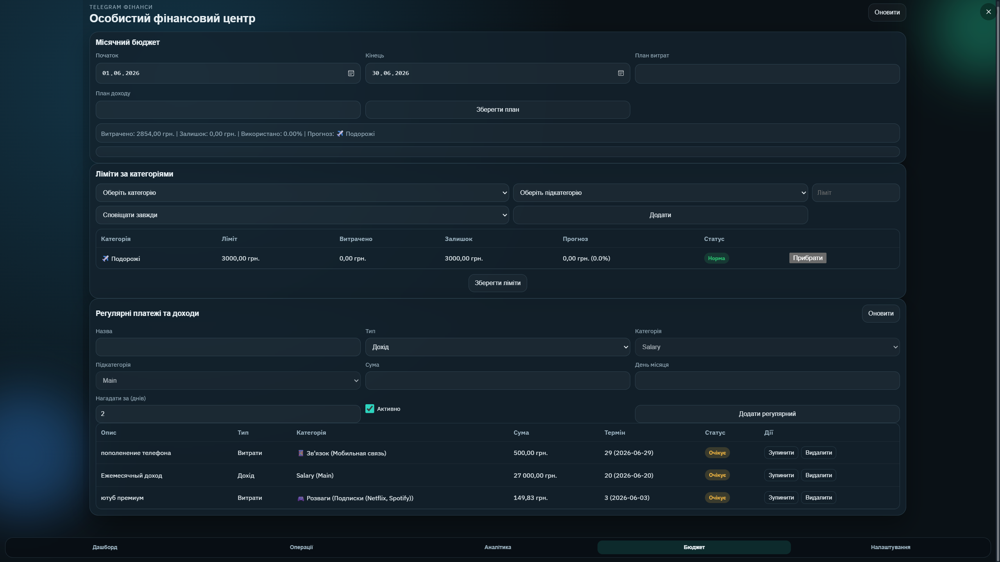
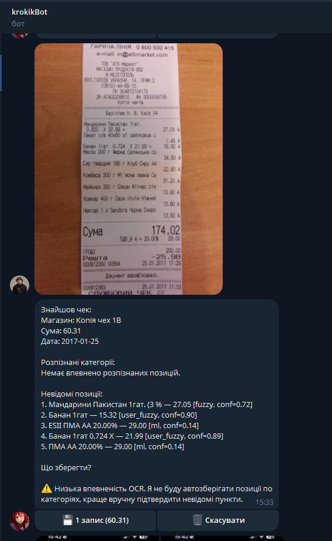
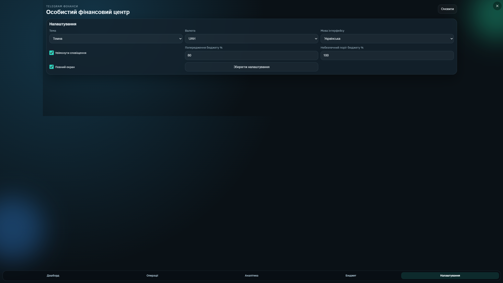
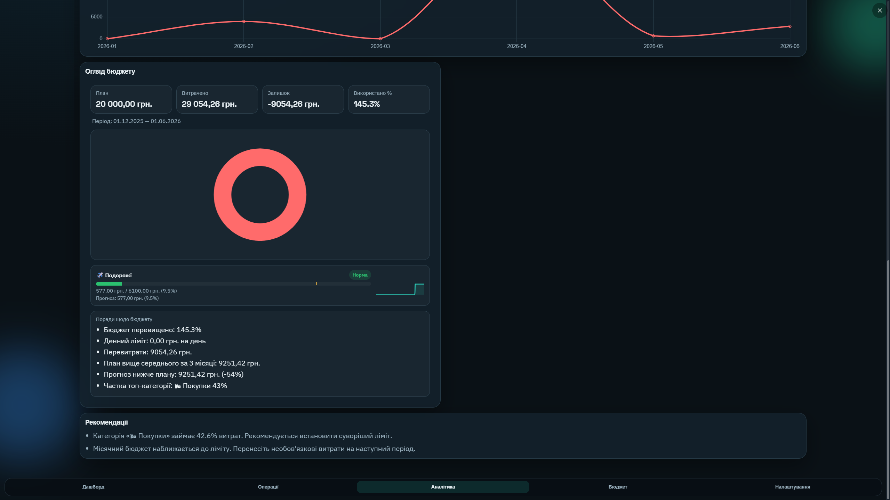

# Telegram Finance Bot + Web App

Языки: [English](README.md) | [Русский](README.ru.md) | [Українська](README.uk.md)

   

> Асинхронный Telegram-бот + Web App для личных финансов с OCR чеков, умной категоризацией, бюджетами и аналитикой.



## Почему этот проект

Это full-stack портфолио-проект, который показывает продакшн-уровень Python:

- асинхронный Telegram UX (aiogram) с реальными сценариями
- FastAPI + PostgreSQL API на SQLAlchemy async
- OCR пайплайн + ML-категоризация
- Web App с графиками, экспортом и бюджетами
- Docker-стек и автоматизированные тесты

## Демо

- Видеообзор: [content/видео_работы.MP4](content/видео_работы.MP4)

## Скриншоты

| Dashboard | Operations | Analytics 1 |
| --- | --- | --- |
|  |  |  |

| Budget | OCR | Settings |
| --- | --- | --- |
|  |  |  |

| Analytics 2 |
| --- |
|  |

## Ключевые особенности

- Telegram команды + быстрый расход + OCR чеков с подтверждением
- Умная категоризация: история -> fuzzy match -> глобальные ключевые слова -> TF-IDF модель
- Планирование бюджета, лимиты по категориям, прогнозы и рекуррентные платежи
- Аналитика с графиками (Chart.js) и экспортом в CSV/PDF
- Мультиязычный UI: `uk`, `ru`, `en`
- Кэширование тяжелых запросов, асинхронный доступ к БД
- Контроль качества OCR + регрессионный корпус

## Технологии

- Python 3.11, aiogram 3, FastAPI, SQLAlchemy async
- PostgreSQL (Docker), SQLite для локальной разработки
- Tesseract OCR + Pillow, `pytesseract`
- ML: scikit-learn TF-IDF + rapidfuzz
- Web App: vanilla JS, Chart.js, Telegram Web App SDK
- Тесты: pytest, pytest-asyncio, Playwright

## Архитектура

```mermaid
flowchart LR
  subgraph Telegram
    U[User]
  end
  U -->|messages / photos| BOT[finance-bot (aiogram)]
  BOT -->|SQLAlchemy async| DB[(PostgreSQL)]
  BOT -->|OCR + parser| OCR[Tesseract + ReceiptParser]
  BOT -->|menu link| WEBAPP[Telegram Web App]

  WEBAPP -->|API /api/webapp/*| API[finance-web (FastAPI)]
  API --> DB
  WEBAPP -->|Charts & UI| UI[Web UI]
```

## Ключевые сценарии

- Быстрый расход: "coffee 50" -> предложение категории -> сохранение
- OCR чеков: фото -> OCR -> парсинг позиций/суммы -> категория -> подтверждение
- Web App: дашборд, операции, аналитика, бюджет, рекуррентные, настройки
- Экспорт: CSV + PDF отчеты

## Быстрый старт

### Локально (pip)

1. Создайте `.env` (скопируйте из `.env.sample`) и укажите `BOT_TOKEN` и `DATABASE_URL`.
1. Установите зависимости:

```bash
pip install -r requirements.txt
```

1. Запустите бота:

```bash
python -m app.bot
```

1. Запустите Web App API + UI:

```bash
python -m app.web_main
```

### Docker (полный стек)

```bash
docker compose -p finance-bot up -d --build
```

### Запуск одной командой + tunnel (Windows)

```powershell
powershell -NoProfile -ExecutionPolicy Bypass -File scripts/start_bot_with_tunnel.ps1
```

Этот скрипт:

- запускает `db` и `finance-web`
- ждет `/api/webapp/health`
- создает временный localhost.run tunnel
- обновляет `WEBAPP_URL` в `.env`
- обновляет кнопку меню Telegram
- запускает `finance-bot`

## Тесты

```bash
pytest tests/
```

### E2E (Playwright)

```bash
pip install -r requirements-dev.txt
python -m playwright install chromium
pytest tests/e2e/test_webapp_playwright.py -q
```

## Структура проекта

- `app/bot.py` точка входа Telegram-бота
- `app/web_main.py` точка входа FastAPI Web App
- `app/services/` OCR, парсинг, категоризация, агрегации
- `app/handlers/` маршруты и сценарии бота
- `app/web/` бэкенд Web App + статический UI
- `tests/` unit + e2e

## Документация

- Обзор архитектуры: [BOT_OVERVIEW.md](BOT_OVERVIEW.md)
- Улучшения категоризации: [IMPROVEMENTS.md](IMPROVEMENTS.md)
- Цели качества OCR: [OCR_QUALITY_TARGETS.md](OCR_QUALITY_TARGETS.md)

## Примечания

- Для продакшена используйте PostgreSQL и настройте `WEBAPP_URL`.
- Бинарь Tesseract должен быть установлен на хосте/в контейнере.
